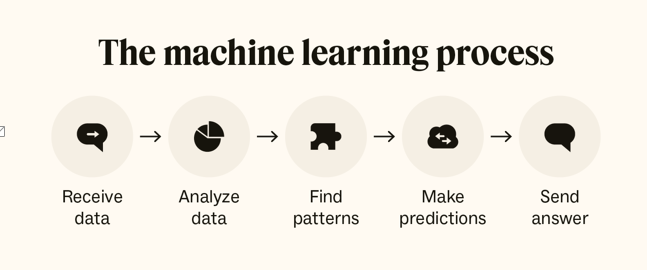
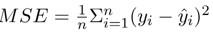

# Topic : Introduction to Neural Networks and Deep Learning
----
## Session 1: Introduction to AI
**What is AI?**

In simple, its a computer program that has the ability to mimic human interaction with machines.
Moreover, it has two subset whiich are Machine learning and Deep learning.

**When,Who and Why?**

In 1957, Arthur Samuel developrd a program to that mimic a checher's movement.
The reason for him creating is that to play against the computer that is programed to predict his next movement and move the chess piece according to it.

**Why AI**

Its programed in a way that it has the ability to solve problems and have insight that human can't. IT can do much more then what human is capable in a short amount of time like identifying the patterns,solve intricate puzzles, and adjust to changing surroundings is essential.  

**How is it possible**

AI are able to do what they are doing(mimicing Human) because they Learn from the data they were fed. Data can be either structure or unstructed data that are either stored in form of text, image, table, graph or numerical values.

**Difference between ML and Deep learning**
| Machine Learning | Deep Learning |
| ----------- | ----------- |
| It was coined in 1959 by Arthur Samuel | It was introduced by Rina Dechter in 1986 |
| Relies on mathematical algorithms to find patterns in data. | Uses programmable neurons inspired by the brain. |
| Handles large datasets (hundreds of thousands of data points). | Handles massive datasets (billions of data points). |
| Effective for simpler tasks like classification. | Effective for complex tasks like game development. |
| Process of Machine learing | Process of Deep learning](../DL.png) |

## Session 2 : Introduction to Neural Network 
### What is a Neural Network

A neural network is a machine learning (ML) model designed to mimic the function and structure of the human brain. In othe word Neural networks are like smart systems that can learn from examples without being explicitly programmed. The neural networks consist of interconnected nodes or neurons that process and learn from data, enabling tasks such as pattern recognition and decision making in machine learning.

### Working of Neural Network

It is composed of an input layer, one or more hidden layers, and an output layer made up of layers of artificial neurons that are coupled. The two stages of the basic process are called backpropagation and forward propagation

1. Forward Propagation
- **Input Layer**: Each feature in the input layer is represented by a node on the network, which receives input data.
- **Weights and Connections**: The weight of each neuronal connection indicates how strong the connection is. Throughout training, these weights are changed.
- **Hidden Layers**: Each hidden layer neuron processes inputs by multiplying them by weights, adding them up, and then passing them through an activation function. By doing this, non-linearity is introduced, enabling the network to recognize intricate patterns(complex ones).
- **Output**: The final result is produced by repeating the process until the output layer is reached.

2. Back Propagation
- **Loss Calculation**: The network’s output is evaluated against the real goal values, and a loss function is used to compute the difference. For a regression problem, the Mean Squared Error (MSE) is commonly used as the cost function.
- **Gradient Descent**: Gradient descent is then used by the network to reduce the loss. To lower the inaccuracy, weights are changed based on the derivative of the loss with respect to each weight.
- **Adjusting weights**: The weights are adjusted at each connection by applying this iterative process, or backpropagation, backward across the network.
- **Training**: During training with different data samples, the entire process of forward propagation, loss calculation, and backpropagation is done iteratively, enabling the network to adapt and learn patterns from the data.
- **Actvation Functions**: Model non-linearity is introduced by activation functions like the rectified linear unit (ReLU) or sigmoid. Their decision on whether to “fire” a neuron is based on the whole weighted input.

### Learning of a Neural Network

| Aspect | Supervised Learning | Unsupervised Learning |
| ----------- | ----------- | ----------- |
| Training Data | Uses labeled training data | Uses unlabeled training data |
| Understanding of Output | Understands what the correct output values should be | Learns the data's inherent structure independently |
| Learning Process | Adjusts iteratively to minimize error | Identifies patterns without specific guidance |
| Goal | Learn relationships between input and output data| Discover new patterns and relationships in data |
| Example Applications | Weather forecasting, pricing changes, sentiment analysis, spam detection | Anomaly detection, big data visualization, customer segmentation |

### Types of Neural Networks
1. **Feedforward Networks**: Data moves from input to output in a single direction without feedback loops. Suitable for regression and pattern recognition tasks.
2. **Multilayer Perceptron (MLP)**: A type of feedforward network with multiple layers, including input, hidden, and output layers. Uses nonlinear activation functions. 
3. **Convolutional Neural Network (CNN)**: Specialized for image processing, CNNs automatically learn hierarchical features from input images, enabling effective image recognition and classification.
4. **Recurrent Neural Network (RNN)**: Designed for sequential data processing, RNNs use feedback loops to capture contextual dependencies. Ideal for time series prediction and natural language processing.
5. **Long Short-Term Memory (LSTM)**: A type of RNN that addresses the vanishing gradient problem by using memory cells and gates to manage information flow.