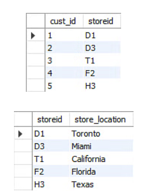

# Topic : Introduction to Normalization
----
## Normalization in DBMS

Database Normalization is a systematic approach used to organize data in relational databases.So what it means is that Normalization is like tidying up our database to make sure it's neat, organized, and free from mistakes. It helps to get rid of unnecessary repetition and ensures that our data is stored efficiently.

### First Normal Form (1NF)

**What is it?** 

Think of 1NF as the basic rule for organizing our data. Each piece of information should be stored in its own little box, and every box should have a unique name. A relation is in first normal form if every attribute in that relation is singled valued attribute.

**Why does it matter?**

 It stops us from having messy, jumbled-up data and makes it easier to search and manage our information.  
 
 For example
 

 Relation STUDENT in table 1 is not in 1NF because of multi-valued attribute STUD_PHONE. Its decomposition into 1NF has been shown in table 2.

### Second Normal Form (2NF)

**What is it?** 

To be in second normal form, a relation must be in first normal form and relation must not contain any partial dependency.
2NF helps to get rid of extra stuff by making sure that everything in our table relates directly to the main thing that identifies each row.

**Why does it matter?** 

It prevents any unnecessary connections between different pieces of data, keeping things clean and clear.

For example

The Location table possesses a composite primary key cust_id, storeid. The non-key attribute is store_location. In this case, store_location only depends on storeid, which is a part of the primary key. Hence, this table does not fulfill the second normal form.

To bring the table to Second Normal Form, we need to split the table into two parts. This will give the below tables
 
 
 As we have removed the partial functional dependency from the location table, the column store_location entirely depends on the primary key of that table, storeid.

### Third Normal Form (3NF):

**What is it?**

A relation is said to be in third normal form, if we did not have any transitive dependency for non-prime attributes and the realyion is in 2NF form. 3NF takes things a step further by making sure that each piece of data in our table doesn't rely on anything else that's not the main identifier.

**Why does it matter?**

 It stops any sneaky connections between bits of data that could cause confusion or mistakes.

 For example

In the above student table, stu_id determines subid, and subid determines sub. Therefore, stu_id determines sub via subid. This implies that the table possesses a transitive functional dependency, and it does not fulfill the third normal form criteria.

Now to change the table to the third normal form, we need to divide the table as shown below.

As we can see in both the tables, all the non-key attributes are now fully functional, dependent only on the primary key.

### Boyce-Codd Normal Form (BCNF)

**What is it?** 

BCNF (Boyce-Codd Normal Form) is just a advanced version of Third Normal Form. BCNF is like 3NF on steroids. It makes sure that each piece of data is only determined by the main identifier, nothing else.

**Why does it matter?** 

It's super strict, but it keeps our data super clean and reliable.

For example

To transform the table into the BCNF, we will divide the table into two parts. One table will hold stuid which already exists and the second table will hold a newly created column profid.

And in the second table will have the columns profid, subject, and professor, which satisfies the BCNF.

### Fourth Normal Form (4NF)

**What is it?** 

We can say a table to be in 4NF if it is in BCNF and contains no multi-valued dependencies or the primary key has a one-to-one relationship to all non-keys fields 4NF is all about getting rid of any tricky situations where one piece of data could be linked to lots of others in a confusing way.

**Why does it matter?** 

It makes sure our data is crystal clear and easy to understand, without any weird connections.

For example.

Make a separate table for multivalued Fields.

### Advantages of Normal Forms:

1. **Less Mess:** Normalization gets rid of clutter(Rebundncy, repetation or inconstiency) and makes our data easy to understand.

2. **Consistency:** It ensures that our data is always accurate and reliable.

3. **Faster Searches:** Organized data means quicker searches and better performance.

4. **Easier Maintenance:** With everything in its place, our database is easier to update and manage.

### Conclusion

Normal forms are like a set of rules for keeping our database tidy and efficient. Each level builds on the last, making sure our data is organized, accurate, and easy to work with. It's all about keeping things neat and tidy so that our database works like a well-oiled machine.