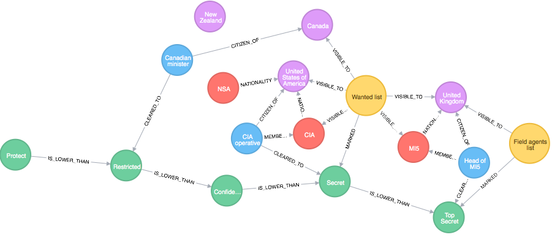

# Topic : Types of Nonrelational Databases
----
## What is Relational Databases
A relational database stores information in tables with specific pieces and types of data. Relational databases use Structured Query Language (SQL) to manage and query the data. 

## What is Nonrelational Databases
A non-relational database, often referred to as NoSQL, stores data in a non-tabular form. They use different data structures like documents, graphs, or key-value pairs

## Relational Databases V/S Nonrelational 

| Aspect | Relational Databases | Non-Relational Databases (NoSQL) |
| ----------- | ----------- | ----------- |
| Data Structure | 	Tables with predefined rows and columns | Various formats like documents, graphs, key-value pairs |
| Flexibility |   Rigid, suited for structured data | Flexible, ideal for diverse and changing data |
| Query Performance | May require complex joins, slower | Often faster due to simpler queries |
| Scalability | May face challenges with massive datasets | Built for scalability, handle massive datasets with ease |
| Cloud Compatibility | May face challenges in cloud environments | Well-suited for cloud due to scalability |
| Development Approach | Suitable for stable environments | Favored for agile environments with rapidly evolving data structures | 

figure showing the visual representation between two database.

## Types of Nonrelational Database
### Document Based Database

A Document Database in NoSQL stores and retrieves data in documents, diverging from traditional relational databases organized by rows and columns. These documents, often formatted in JSON, BSON, or XML, encapsulate data as key-value pairs, enabling a flexible and hierarchical data structure.

Visual of how data are stored in Documnet based

### Advantages

1. **No strict rules:** we can store data without needing to decide on a fixed structure beforehand.

2. **Quick to make and maintain:** Creating and updating documents is easy and doesn't take much effort.

3. **Easy to share:** Data is stored in simple formats like JSON, making it easy to work with and share.

4. **Keeps track of changes:** It can remember how documents change over time, which helps manage complex data.

### Disadvantages

1. **Not great for big transactions:** It struggles with handling big operations that involve multiple documents at once.

2. **Checking consistency can be slow:** Sometimes, making sure all documents are correct can slow down the database.

3. **Security worries:** Because it's often used for web apps, there can be concerns about keeping data safe from hackers.

### Applications

1. **Managing content:** Perfect for websites with lots of different types of content, like blogs or video sites.

2. **Organizing books:** Useful for libraries or bookstores to keep track of book info in a structured way.

3. **Handling big catalogs:** Good for stores with lots of products, as it can handle lots of information easily.

4. **Doing analytics:** Great for analyzing data and finding trends, like in sales or website traffic.

### Key-Value based databases

A key-value data model, also known as a key-value store, is a type of non-relational database where data is stored as simple key-value pairs.

Visual of how Key-Value database look like.

### Advantages

1. **No strict rules:** we can store data without needing to decide on a fixed structure beforehand.

2. **Quick to make and maintain:** Creating and updating key-value pairs is easy and doesn't take much effort.

3. **Easy to share:** Data is stored in simple formats like JSON, making it easy to work with and share.

4. **Keeps track of changes:** It can remember how key-value pairs change over time, which helps manage complex data.

### Disadvantages:

1. **Not great for big transactions:** It struggles with handling big operations that involve multiple key-value pairs at once.

2. **Checking consistency can be slow:** Sometimes, making sure all key-value pairs are correct can slow down the database.

3. **Security worries:** Because it's often used for web apps, there can be concerns about keeping data safe from hackers.

### Application:

1. User session attributes in real-time applications like finance or gaming, where quick access to random data is crucial.

2. Caching mechanism for frequently accessed data or key-based designs, optimizing performance by storing data closer to the application.

3. Ideal for applications relying heavily on key-based queries, simplifying data retrieval and manipulation based on unique identifiers.

### Graph Database
A graph database is a type of NoSQL database that is designed to handle data with complex relationships and interconnections. In a graph database, data is stored as nodes and edges, where nodes represent entities and edges represent the relationships between those entities.

visual representation of the graph database.

### Advantages

1. **Efficient data modeling:** Allows flexible and scalable data modeling.

2. **Flexible relationships:** Handles complex relationships well.

3. **High performance:** Optimized for large and complex datasets.

4. **Scalability:** Easily scales to handle increased data volume or traffic.

5. **Easy to use:** Typically simpler to use and maintain than traditional relational databases.

### Disadvantages:

1. **Slower for complex relationships:** Sometimes slower for very complex relationship queries.

2. **Platform-dependent query language:** The query language may vary between platforms.

3. **Not suitable for transactional data:** May not be the best choice for transactional data.

4. **Limited use cases:** Not suitable for all applications, especially those requiring simple queries.

### Applications:

1. **Recommendation engines:** Provides accurate recommendations in e-commerce.

2. **Social media:** Finds connections between friends and products.

3. **Fraud detection:** Identifies fraudulent transactions by analyzing relationships.

4. **Network and infrastructure management:** Manages complex network relationships effectively.

###  Vector Databases

A Vector Database is a type of relational database system specifically tailored to handle vectorized data. Instead of conventional tables, rows, and columns, it processes vectors—arrays of numerical values representing points in multidimensional space.

Embedding is a data like words that have been converted into an array of numbers known as a vector that contains patterns of relationships the combination of these numbers that make up the vector act as a multi-dimensional map to measure similarity.

### Advantages

1. **Efficient Data Handling:** Vector databases efficiently manage structured and unstructured data, optimizing storage and retrieval of high-dimensional vectors.

2. **Specialized Search Criteria:** These databases allow searches based on predefined criteria or vector distance, providing contextually relevant results.

3. **Optimized Data Processing:** Vector databases are optimized for analytical queries and aggregations, making them suitable for complex analytical tasks.

4. **Storage Efficiency:** They are designed to store and query large volumes of data efficiently, making them ideal for handling big data workloads.

5. **Diverse Applications:** Vector databases find applications in various fields including semantic search, time-series data analysis, IoT applications, and real-time analytics.

### Disadvantages

1. **Slower for Complex Relationships:** They may exhibit slower performance for very complex relationship queries compared to traditional databases.

2. **Platform-Dependent Query Language:** The query language used in vector databases may vary between platforms, potentially causing compatibility issues.

3. **Not Suitable for Transactional Data:** Vector databases may not be well-suited for transactional operations and ad-hoc queries, limiting their applicability in certain scenarios.

4. **Limited Use Cases:** They are not suitable for all applications, especially those requiring simple queries or primarily dealing with vector data.

### Applications

1. **Semantic Search:** Vector databases are used for semantic search applications where results are ranked based on relevance to a query string.

2. **Time-Series Data Analysis:** They find applications in analyzing time-series data for trend analysis and forecasting.

3. **IoT Applications:** Vector databases are utilized in IoT applications for managing and analyzing sensor data.

6. **Real-Time Analytics:** They enable real-time analysis of high-dimensional data, facilitating timely decision-making based on contemporary data.

### Timeseries Database

A Time Series Database (TSDB) is a software system that is optimized to handle time series data, arrays of numbers indexed by time (a datetime or a datetime range). Time series data is a sequence of data points indexed in time order making them ideal for applications that require the analysis of historical data over time. Examples of time series data include stock prices, weather data, and sensor readings.

visual representation of how it looks like.

### Advantages
1. **Optimized for Time Series Data:** TSDBs are specifically designed to handle time series data, making them highly efficient for storing and querying this type of data.

2. **Compression:** They often use data compression techniques to reduce the storage space required for time series data, which can be very large.

3. **High Performance:** TSDBs are optimized for write-heavy workloads, where data is continuously being added. They can handle high volumes of data and provide fast query performance.

4. **Scalability:** They are designed to scale horizontally, allowing for the addition of more nodes to handle increased data volume and query load.

5. **Data Retention Policies:** Many TSDBs support automatic data retention policies, making it easy to manage the lifecycle of time series data.

6. **Support for Aggregation and Downsampling:** TSDBs often support aggregation functions and downsampling, which are useful for reducing the granularity of data and for analyzing trends over time.

### Disadvantages
1. **Complexity:** TSDBs can be more complex to set up and manage compared to traditional relational databases.

2. **Limited Query Flexibility:** While they are optimized for time series data, TSDBs may offer limited flexibility in querying compared to more general-purpose databases.
3. **Learning Curve:** There can be a steep learning curve for developers who are not familiar with time series data and the specific features and syntax of TSDBs.

4. **Cost:** Some TSDBs can be expensive, especially for large-scale deployments.

5. **Limited Support for Non-Time Series Data:** While they excel at handling time series data, TSDBs may not be the best choice for applications that require handling a wide variety of data types.

### Applications
1. **Monitoring and Alerting:** TSDBs are widely used in monitoring systems to store and analyze metrics over time, enabling real-time alerting based on predefined thresholds.

2. **Financial Markets:** They are used in financial markets to store and analyze stock prices, trading volumes, and other financial indicators.

3. **IoT (Internet of Things):** TSDBs are ideal for storing and analyzing data from IoT devices, such as sensor readings from various devices in a smart home or industrial environment.

4. **Networking:** In network monitoring, TSDBs can store and analyze data related to network traffic, performance, and security incidents.

5. **Weather Forecasting:** They are used in meteorological services to store and analyze weather data, enabling the creation of weather forecasts.

6. **Healthcare:** In healthcare, TSDBs can store and analyze patient data, such as heart rate, blood pressure, and other vital signs, over time.