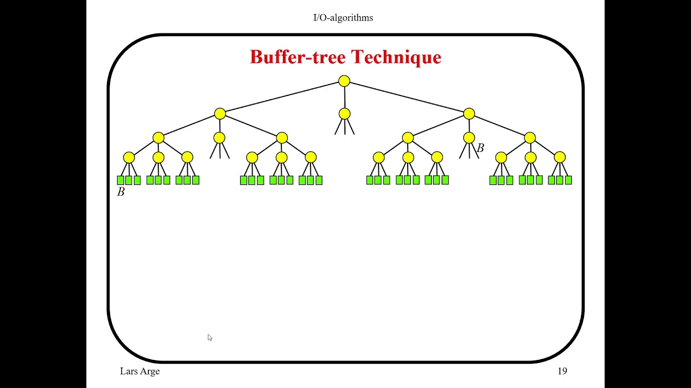

# Topic :  Indexing
----

Indexing in terms of data, is a technique used to speed up the process of retrieving data. Indexes are used to quickly locate data without having to search every row in a database table every time a database table is accessed. 
## Indexing of Spatial and Temporal Data.

**Spatial data** refers to info with a location aspect, like maps or graphs, while **temporal data** involves time-related details, such as events or changes over time. Combining these lets us study how things move or change in both space and time.

Indexing helps organize and find this data quickly. For example, a GPS uses spatial indexing to find your location fast. Temporal indexing does the same but for time-related info. Together, they help us study stuff like like weather patterns, traffic flow, or disease spread efficiently.

### Applications:
- Geographic Info Systems (GIS): For maps and location-based analysis.
- Computer Graphics: Helps in making video games or virtual worlds.
- Robotics: Useful for robots to navigate around obstacles.
- Image Processing: Helps in editing or analyzing pictures.

### Pros:
- Saves time: Makes finding and using data faster.
- Works in many areas: Useful for lots of different tasks.
- Handles big data: Can deal with large amounts of info.

### Cons:
- Tricky to set up: Needs smart people to make it work right.
- Can slow down: Sometimes struggles with lots of data or complex situations.
- Costs money: Building and maintaining these systems can be expensive.

spatio-temporal data

## Bitmap Indices
Bitmap indexing is a clever method in databases that makes finding stuff super fast, especially when we are looking for things in big lists.  It represents each value in the column as a bitmap, where each bit corresponds to a row in the table. If a bit is set (1), it indicates that the corresponding row has the value; if it's not set (0), the row does not have the value.

### How It Works
Bitmap indexing is used to reduce the response time for large classes and queries by avoiding expensive I/O operations. It achieves this by using a compressed representation of the data, which reduces the amount of data that needs to be read from the disk. 

### Application
- Big Data: It's great for handling huge amounts of info, like in big databases.
- Quick Searches: Makes finding stuff faster, especially when you're looking for specific types of things.
- Smart Shopping: Helps online stores show you things you might like based on what you've looked at before.

### Pros
- Fast Searches: Helps find stuff quickly, especially in large databases.
- Saves Space: Doesn't take up too much room in the database.
- Useful for Big Lists: Works well when there are lots of items to search through.
### Cons
- Not Great for Small Lists: Doesn't work as well for smaller collections of items.
- Can Be Tricky to Keep Up: Sometimes, updating the maps can be a bit tricky.
- Best for Finding, Not Changing: It's better for looking at stuff than for adding or changing things.

## Buffer Tree

A buffer tree is a specialized form of a tree data structure designed for efficient data access and modification. in simple a buffer tree is like a smart organizer for data, designed to help quickly find and update information, especially in big datasets. It's commonly used in databases and file systems.

### How It Works
Think of a buffer tree as a big family tree, where each member represents a chunk of data. The top of the tree (the root) represents all the data, and each branch down the tree breaks the data into smaller pieces. This setup makes it easy to search and change only the parts of the data you need, instead of sifting through everything.

### Application
- Databases: Great for sorting and finding data fast in databases.
- File Systems: Helps manage files efficiently, making file operations quicker.
- Quick Data Changes: Useful in systems where data needs to be accessed and updated fast, like real-time systems.

### Pros
- Fast Access: Helps find and change data quickly, even in huge datasets.
- Adaptable: Can change size and structure easily as data grows or shrinks.
- Organized: Its tree structure makes finding and updating data efficient.

### Cons
- Needs Memory: Takes up quite a bit of memory, especially for large datasets.
- Can Get Lopsided: If it's not balanced well, finding data might take longer.
- Tricky to Set Up: Building and managing a buffer tree can be complex, especially for those not familiar with it.

