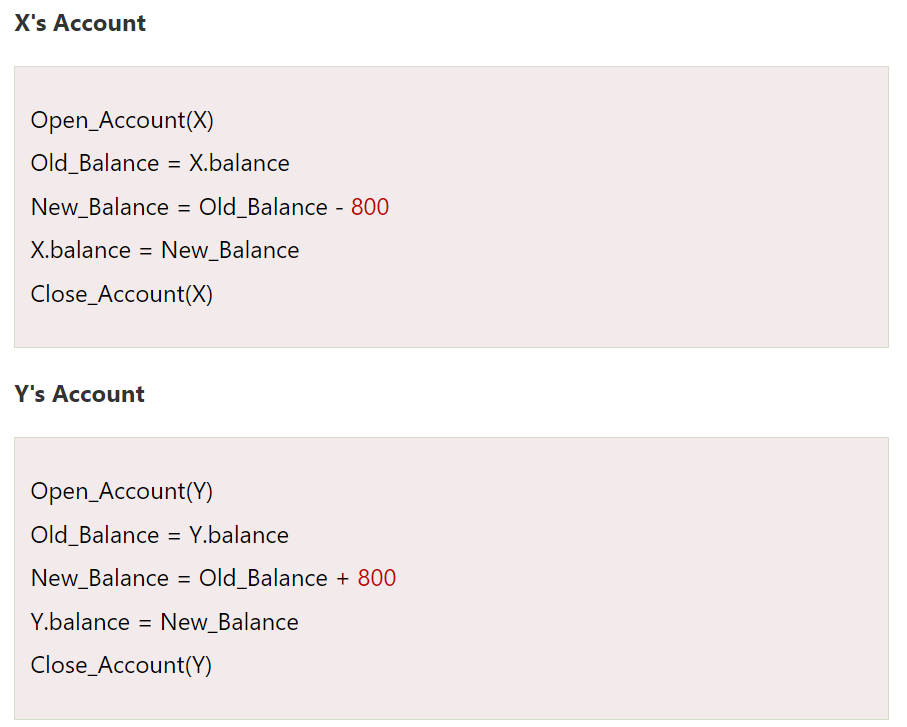
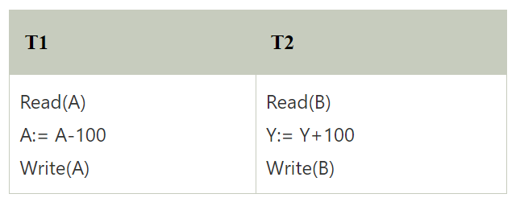

# Topic :  Transaction and Seridizability
----
## Transaction
- The transaction is a set of logically related operation. It contains a group of tasks.
- A transaction is an action or series of actions. It is performed by a single user to perform operations for accessing the contents of the database.

**Example:**

 Suppose an employee of bank transfers Rs 800 from X's account to Y's account. This small transaction contains several low-level tasks:
 

 ### Operations of Transaction

1. **Read(X):** Read operation is used to read the value of X from the database and stores it in a buffer in main memory.

2.  **Write(X):** Write operation is used to write the value back to the database from the buffer.

3. **Commit:** It is used to save the work done permanently.

4. **Rollback:** It is used to undo the work done.

### Transaction property
The transaction has the four properties. These are used to maintain consistency in a database, before and after the transaction.

### Property of Transaction
1. Atomicity
2. Consistency
3. Isolation
4. Durability

1. **Atomicity**
- It states that all operations of the transaction take place at once if not, the transaction is aborted.
- There is no midway, i.e., the transaction cannot occur partially. Each transaction is treated as one unit and either run to completion or is not executed at all.

Atomicity involves the following two operations:
- **Abort:** If a transaction aborts then all the changes made are not visible.

- **Commit:** If a transaction commits then all the changes made are visible.

Example: Let's assume that following transaction T consisting of T1 and T2. A consists of Rs 600 and B consists of Rs 300. Transfer Rs 100 from account A to account B.

After completion of the transaction, A consists of Rs 500 and B consists of Rs 400.

If the transaction T fails after the completion of transaction T1 but before completion of transaction T2, then the amount will be deducted from A but not added to B. This shows the inconsistent database state. In order to ensure correctness of database state, the transaction must be executed in entirety.

2. **Consistency**
- The integrity constraints are maintained so that the database is consistent before and after the transaction.
- The execution of a transaction will leave a database in either its prior stable state or a new stable state.
- The consistent property of database states that every transaction sees a consistent database instance.
- The transaction is used to transform the database from one consistent state to another consistent state.

For example: The total amount must be maintained before or after the transaction.

**Total before T occurs = 600+300=900**  
**Total after T occurs= 500+400=900**

Therefore, the database is consistent. In the case when T1 is completed but T2 fails, then inconsistency will occur.

3. **Isolation**
- It shows that the data which is used at the time of execution of a transaction cannot be used by the second transaction until the first one is completed.
- In isolation, if the transaction T1 is being executed and using the data item X, then that data item can't be accessed by any other transaction T2 until the transaction T1 ends.
- The concurrency control subsystem of the DBMS enforced the isolation property.

4. Durability
- The durability property is used to indicate the performance of the database's consistent state. It states that the transaction made the permanent changes.
- They cannot be lost by the erroneous operation of a faulty transaction or by the system failure. When a transaction is completed, then the database reaches a state known as the consistent state. That consistent state cannot be lost, even in the event of a system's failure.
- The recovery subsystem of the DBMS has the responsibility of Durability property.

### States of Transaction
In a database, the transaction can be in one of the following states-

## Serializability
Serializability in DBMS ensures safe parallel execution of transactions by enforcing rules, preventing unexpected or incorrect results. Each transaction is treated as if it's the only one running, maintaining integrity. 

DBMS employs a technique called concurrency control to achieve serializability.  This technique helps ensure that multiple transactions do not interfere with each other's execution by controlling their access to shared resources. 

### Serializable Schedule in DBMS

A serializability schedule in DBMS ensures that concurrent transactions produce the same final result as if they were executed one after the other. It also helps to maintain the data consistency and integrity and ACID property of any Database.

### Types of Schedules in DBMS
1. **Serial schedule**
These are those schedules in which transactions are executed sequentially, meaning a new transaction doesn't begin until the previous one has concluded.

### Non-serial schedule
This scheduling method involves interleaving the operations of multiple transactions, potentially increasing concurrency challenges. Transactions are executed concurrently, yet the final outcome remains consistent and identical to a serial schedule. It is further divided into two parts:

1. Serializable(Conflict and View Serializable)
2. Non- serializable(Recoverable and Non-recoverable)

### Types of Serializability in DBMS
1. **Conflict Serializable**
Conflict serializability is a property of a schedule. It ensures that it is equivalent to a serial schedule.  

A schedule can be declared as conflict serializable if and only if all conflicting pairs of transactions in the schedule have the same relative order in all serial schedules that are equivalent to the given schedule.

Example:
Consider a schedule with three transactions, T1, T2, and T3, and the following set of operations:

- T1: R(P), W(Q)
- T2: R(Q), W(R)
- T3: R(R), W(P)

The operations that are performed in the transactions are R(Read) and W(Write) operations on the data items ‘P’ and ‘Q’

In a precedence graph, the edges represent the ordering constraints between transactions in the concurrent execution of a database system.

The conflict serializability of the schedule can be determined by constructing a precedence graph as follows:
- T1 -> T2
- T2 -> T3
- T3 -> T1

The graph has a cycle (T1 -> T2 -> T3 -> T1), indicating that the schedule is not conflict serializable.

2. **View Serializability**
View serializability is a property of a schedule. It ensures that it is equivalent to a serial schedule with the same set of read and write operations. 

A schedule is declared as view serializable if and only if it produces the same set of values for all read operations as any serial schedule that is equivalent to the given schedule.

Example:
Consider a schedule with three transactions, T1, T2, and T3, and the following set of operations:

- T1: R(P), W(Q)
- T2: R(Q), W(R)
- T3: R(R), W(P)
 
The operations that are performed in the transactions are R(Read) and W(Write) operations on the data items ‘P’ and ‘Q’.

In a VSG, the edges represent the ordering constraints between transactions in the concurrent execution of a database system.

We must first identify the view equivalent schedules for the given concurrent execution to obtain the edges in this graph. Two schedules are view equivalent if they produce the same set of database states for any initial database state.

The view serializability of the schedule can be determined by constructing a VSG as follows:

- T1 -> T2
- T2 -> T3
- T3 -> T1

The VSG has a cycle (T1 -> T2 -> T3 -> T1), indicating that the schedule is not view serializable.

## Conclusion

Transactions are crucial for ensuring that database operations are executed reliably and consistently, maintaining data integrity through the ACID properties: Atomicity, Consistency, Isolation, and Durability. Serializability is an important concept that ensures transactions run concurrently without causing conflicts, preserving the integrity and correctness of the database. By understanding and implementing serial and non-serial schedules, and ensuring conflict and view serializability, its important to note that it can prevent issues and ensure smooth and accurate database operations.