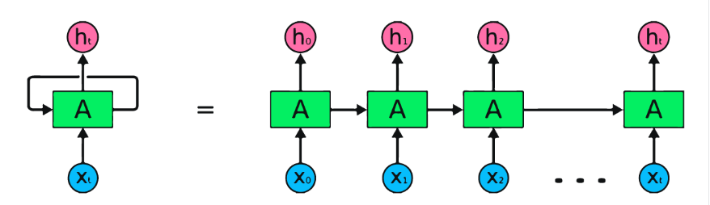
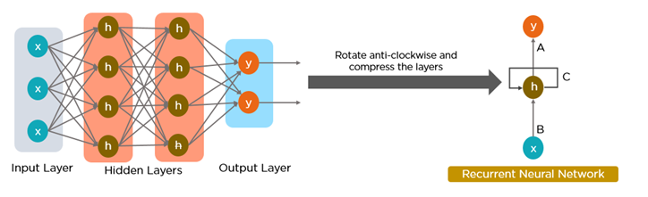
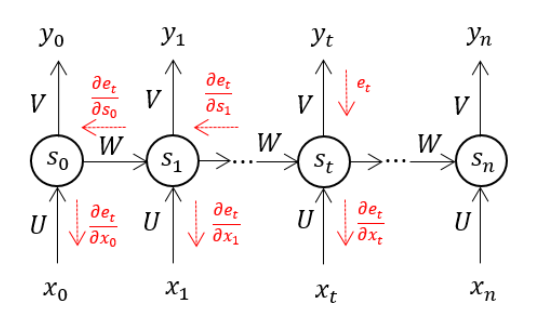
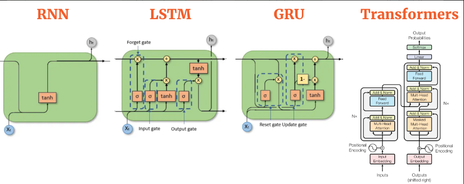

# Topic : Recurrent Neural Networks (RNN)
----

## Introduction
Ever wonder how chatbots understand your questions or how apps like Siri and voice search can decipher your spoken requests? The secret weapon behind these impressive feats is a type of artificial intelligence called Recurrent Neural Networks (RNNs).

### What is Recurrent Neural Networks (RNN)
A Recurrent Neural Network (RNN) is a type of artificial neural network that is designed to process sequential data, such as text, speech, or time series data. Unlike traditional feedforward neural networks, where the inputs and outputs are independent of each other, RNNs have an internal memory that allows them to maintain information about the past inputs, enabling them to make predictions or decisions based on the current input as well as the previous inputs, meaning that the output is dependent to the input.

### What Makes RNN Special?
Recurrent neural networks (RNNs) set themselves apart from other neural networks with their unique capabilities:

1. **Internal Memory:** It allows RNN to remember past inputs and use that context when processing new information.
2. **Sequential Data Processing:** Because of their memory, RNNs are exceptional at handling sequential data where the order of elements matters. This makes them ideal for tasks like speech recognition, machine translation, natural language processing(nlp) and text generation.
3. **Contextual Understanding:** RNNs can analyze the current input in relation to what they’ve “seen” before. This contextual understanding is crucial for tasks where meaning depends on prior information.
4. **Dynamic Processing:** RNNs can continuously update their internal memory as they process new data. This allows them to adapt to changing patterns within a sequence.

### RNN Architecture
Here’s a breakdown of its key components:
- **Input Layer:** This layer receives the initial element of the sequence data. For example, in a sentence, it might receive the first word as a vector representation.
- **Hidden Layer:** The heart of the RNN, the hidden layer contains a set of interconnected neurons. Each neuron processes the current input along with the information from the previous hidden layer’s state. This “state” captures the network’s memory of past inputs, allowing it to understand the current element in context.
- **Activation Function:** This function introduces non-linearity into the network, enabling it to learn complex patterns. It transforms the combined input from the current input layer and the previous hidden layer state before passing it on.
- **Output Layer:** The output layer generates the network’s prediction based on the processed information. In a language model, it might predict the next word in the sequence.
- **Recurrent Connection:** A key distinction of RNNs is the recurrent connection within the hidden layer. This connection allows the network to pass the hidden state information (the network’s memory) to the next time step. It’s like passing a baton in a relay race, carrying information about previous inputs forward.

### The Architecture of a Traditional RNN
RNNs are a type of neural network that has hidden states and allows past outputs to be used as inputs. They usually go like this:

### Types of RNN Architectures
There are four types of RNN based on different lengths of inputs and outputs.

1. One-to-one is a simple neural network. It is commonly used for machine learning problems that have a single input and output.
2. One-to-many has a single input and multiple outputs. This is used for generating image captions.
3. Many-to-one takes a sequence of multiple inputs and predicts a single output. It is popular in sentiment classification, where the input is text and the output is a category.
4. Many-to-many takes multiple inputs and outputs. The most common application is machine translation.

### How does Recurrent Neural Networks work?

**Run through**
1. Input Layer: Receives the initial data element.

2. Hidden Layer: Processes current input and past information using interconnected neurons.

3. Activation Function: Introduces non-linearity, helping the network learn complex patterns.

4. Output Layer: Generates predictions based on processed data.

5. Recurrent Connection: Passes hidden state information to the next time step, ensuring continuity.

### Common Activation Functions

1. Sigmoid Function (σ(x))
- Formula: σ(x) = 1 / (1 + e^(-x))
- Behavior: Squishes any real number between 0 and 1.

2. Hyperbolic Tangent (tanh(x))
- Formula: tanh(x) = (e^x – e^(-x)) / (e^x + e^(-x))
- Behavior: Squeezes any real number between -1 and 1.

3. Rectified Linear Unit (ReLU)(x))
- Formula: ReLU(x) = max(0, x)
- Behavior: Outputs the input value if positive, otherwise outputs 0.

4. Leaky ReLU (Leaky ReLU(x))
- Formula: Leaky ReLU(x) = max(α * x, x) (where α is a small positive value, typically 0.01)
- Behavior: Similar to ReLU, but for negative inputs, it outputs a small fraction of the input instead of 0.

5. Softmax (softmax(x))
- Formula: softmax(x)i = exp(x_i) / Σ(exp(x_j)) (where i represents an element in the vector x and Σ denotes the sum over all elements j in x)
- Behavior: Converts a vector of real numbers into a probability distribution where all elements sum to 1.

### Advantages and disadvantages of RNN
1. Advantages of RNNs:

- Handle sequential data effectively, including text, speech, and time series.
- Process inputs of any length, unlike feedforward neural networks.
- Share weights across time steps, enhancing training efficiency.

2. Disadvantages of RNNs:

- Prone to vanishing and exploding gradient problems, hindering learning.
- Training can be challenging, especially for long sequences.
- Computationally slower than other neural network architectures.

### Backpropagation Through Time (BPTT)
When we apply a Backpropagation algorithm to a Recurrent Neural Network with time series data as its input, we call it backpropagation through time.

A single input is sent into the network at a time in a normal RNN, and a single output is obtained. Backpropagation, on the other hand, uses both the current and prior inputs as input. This is referred to as a timestep, and one timestep will consist of multiple time series data points entering the RNN at the same time.

The output of the neural network is used to calculate and collect the errors once it has trained on a time set and given you an output. The network is then rolled back up, and weights are recalculated and adjusted to account for the faults.

### Two Issues of Standard RNNs

**Whats a Gradient** A gradient is used to measure the change in all weights in relation to the change in error.

 
1. **Exploding Gradients:** Exploding gradients occur when the algorithm gives the weights an absurdly high priority for no apparent reason. Fortunately, truncating or squashing the gradients is a simple solution to this problem.

2. **Vanishing Gradients:** Vanishing gradients occur when the gradient values are too small, causing the model to stop learning or take far too long. This was a big issue in the 1990s, and it was far more difficult to address than the exploding gradients. Fortunately, Sepp Hochreiter and Juergen Schmidhuber’s LSTM concept solved the problem.

### Solution to overcome the issues of RNN
To overcome issues like vanishing and exploding gradient descents that hinder learning in long sequences, researchers have introduced new, advanced RNN architectures.

1. **Long Short-Term Memory (LSTM):** A popular choice for complex tasks. LSTM networks introduce gates that are, input gate, output gate and forget gate that control the flow of information within the network, allowing them to learn long-term dependencies more effectively than vanilla RNNs.

2. **Gated Recurrent Unit (GRU):** Similar to LSTMs, GRUs use gates to manage information flow. However, they have a simpler architecture, making them faster to train while maintaining good performance. This makes them a good balance between complexity and efficiency.
3. **Bidirectional RNN:** This variation processes data in both forward and backward directions. This allows it to capture context from both sides of a sequence, which is useful for tasks like sentiment analysis where understanding the entire sentence is crucial.

4. **Deep RNN:** By stacking multiple RNN layers on top of each other, deep RNNs create a more complex architecture. This allows them to capture intricate relationships within very long sequences of data. They are particularly useful for tasks where the order of elements spans long stretches.

## Conclusion
Recurrent Neural Networks (RNNs) are a powerful and versatile tool with a wide range of applications. They are commonly used in language modeling and text generation, as well as voice recognition systems because of their ability to process sequential data and capture long-range dependencies.

However it has its limitation known  as the vanishing gradient problem. To address this issue, a specialized type of RNN called Long-Short Term Memory Networks (LSTM) has been developed, RNNs, with their ability to process sequential data, have revolutionized various fields, and their impact continues to grow with ongoing research and advancements.