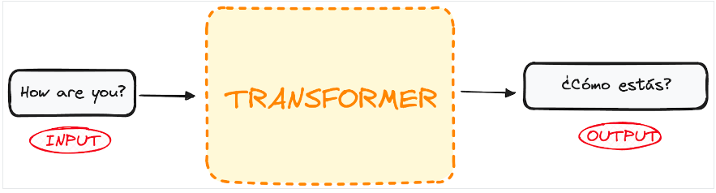
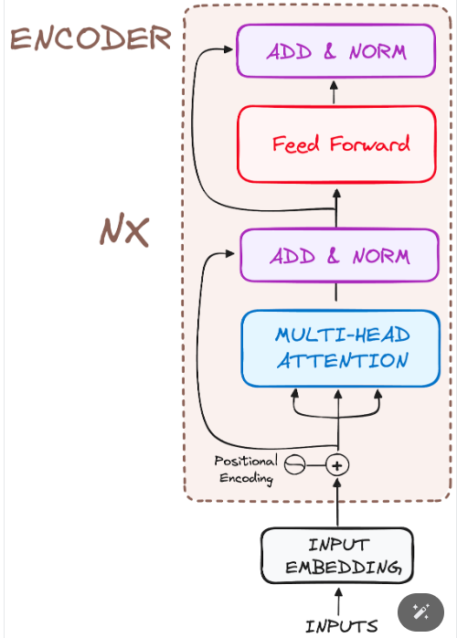

# Topic : Transformers
----

## Introduction
The field of Natural Language Processing (NLP) has witnessed remarkable advancements over the past few decades, driven by the tireless efforts of researchers. This jounal drives into one of the most significant innovations in NLP: Transformers. We will explore their advantages over traditional models, delve into their working mechanisms, and highlight real-world applications using Hugging Face Transformers.

### What are Transformers in NLP?
Transformers, introduced by Google Brain in 2017 through the groundbreaking paper "Attention is All You Need," represent a paradigm shift in NLP. Unlike their predecessors, Recurrent Neural Networks (RNNs), which process data sequentially, Transformers leverage an attention mechanism that allows for parallel processing of data. This innovation addresses several limitations of RNNs, such as slow training times and difficulty handling long-range dependencies.

### Key Components of Transformers
Transformers consist of two main blocks:**the encoder** and **the decoder**, each incorporating a self-attention mechanism. Initially, Transformers used RNN and LSTM encoder-decoder architectures, but these were later replaced with self-attention and feed-forward networks.

1. Input Sentence Preprocessing
- **Tokenization and Embedding:** The input sentence is tokenized, and embeddings are generated for each word.
- **Positional Encoding:** Positional encoding reintroduces the order information discarded during tokenization by creating context vectors for each word.

2. Encoder Block
1. **Input Embeddings:** Converts words into numerical vectors.

2. **Positional Encoding:** Adds information about the position of words in a sentence.

3. **Multi-Head Self-Attention:** Allows the model to focus on different parts of the input sentence simultaneously.

4. **Feed-Forward Neural Network:** Further processes the information.

5. **Normalization and Residual Connections:** Helps stabilize and speed up training.

3. Decoder Block
1. **Output Embeddings:** Converts the previously generated output into vectors.

2. **Positional Encoding:** Adds position information to these vectors.

3. **Masked Self-Attention:** Ensures the model does not look ahead in the output sequence.

4. **Encoder-Decoder Attention:** Aligns the encoder’s outputs with the decoder’s current state.

5. **Feed-Forward Neural Network:** Processes the combined information.

6. **Linear Classifier and Softmax:** Generates the final output by predicting the next word.

### Why Transformers Outperform RNNs
1. **Computational Efficiency:** Lower computational complexity at each layer compared to RNNs.
2. **Parallelization:** Eliminates the need for sequential processing, allowing parallel computation.
3. **Improved Learning:** Shortens the path for forward and backward signals, enhancing the learning process for long sequences.

### Transfer Learning in NLP
Training deep neural networks like Transformers from scratch poses challenges such as data scarcity and high computational costs. Transfer learning addresses these issues by reusing pre-trained models.

### Benefits of Transfer Learning
- Reduced Training Time: Speeds up the training process for new models.
- Cost Efficiency: Lowers the need for extensive computational resources.
- Data Utilization: Leverages large pre-trained models, mitigating the need for vast amounts of new data.

### Popular Transfer Learning Models
- BERT: Developed by Google in 2018, BERT excels in tasks like named entity recognition, sentiment analysis, and text summarization.
- GPT-3: OpenAI’s GPT-3 generates human-like text responses and is used for a variety of text generation tasks.
Hugging Face Transformers: Democratizing NLP

## Conclusion
Transformers have significantly impacted NLP by enabling faster training and better handling of complex tasks compared to traditional models. Their parallel processing capability and effectiveness in managing long-range dependencies have revolutionized machine learning, making advanced language processing more efficient and accessible. 
