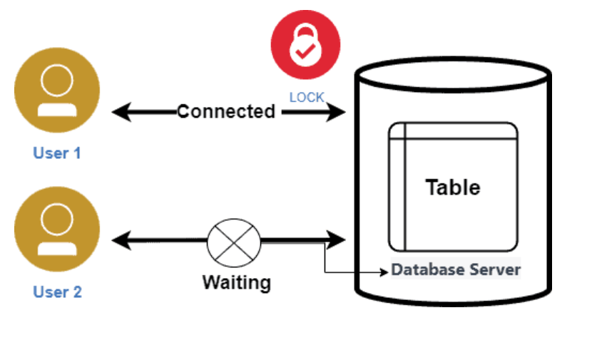
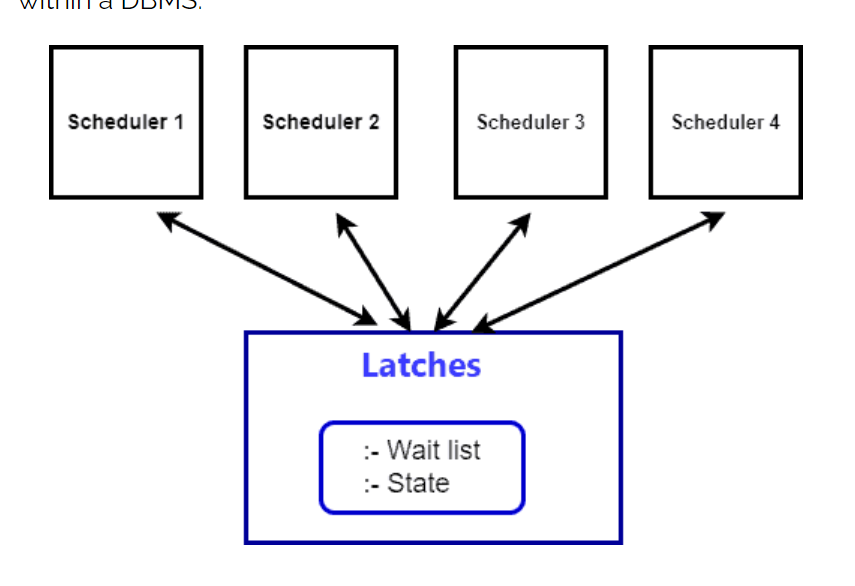

# Topic :  Concurrency Control
----

In this blog, we are going to see what a concurrency control system is and the differences between locks and latches.

## What is Concurrency Control
Concurrency Control is a significant component in the field of database management systems (DBMS). It helps maintain consistency, integrity, and isolation among multiple transactions that are executing parallelly in a system.

### Functionality and Features
Concurrency Control ensures that simultaneous transactions on a DBMS do not interfere with each other. It also prevents common issues like dirty reads, lost updates, and non-repeatable reads. The key features include deadlock avoidance, ensuring serializability of transactions, and maintaining data integrity.

Moreover Concurrency Control boosts the performance of a DBMS by allowing simultaneous transactions. However, the choice of protocol and its implementation impacts the effectiveness of this performance boost.

### Benefits and Use Cases
- Enhances the efficiency and reliability of the DBMS
- Allows multiple transactions to occur simultaneously, increasing overall throughput
- Essential in multi-user database systems and real-time systems
- Crucial for maintaining consistency and speed in data processing

### Challenges and Limitations:

- Introduces complexity in dealing with deadlocks and managing the necessary locks
- The chosen concurrency control protocols can impact the system's performance
- Requires fine-tuning to achieve optimal results
- The additional overhead of concurrency control mechanisms may affect system performance

### Architecture:

The architecture of Concurrency Control comprises various protocols:
1. Two-phase Locking (2PL)
2. Timestamp Ordering (TO)
3. Optimistic Concurrency Control (OCC)

Each protocol has its own unique way of delivering concurrency control:
1. **Two-phase Locking (2PL)**

- Divides the locking process into two  phases: growing(acquaring the locks till all locks are obtained) and shrinking(releases the locks that was acquired).
- Ensures serializability by controlling the acquisition and release of locks

2. **Timestamp Ordering (TO)**

- Assigns unique timestamps to transactions
- Resolves conflicts based on the relative timestamps of transactions
- protocals involved RTS(read timestamp) and WTS(write timestamp)

3. **Optimistic Concurrency Control (OCC)**

- Assumes that conflicts are rare and allows transactions to execute without acquiring locks
- Performs validation and conflict resolution during the commit phase

## Locks v/s Latches
## What Are Locks?
Locks serve as synchronization mechanisms for concurrency control. They regulate access to shared data items and ensure data consistency during concurrent transactions:

A lock enables transactions to acquire read or write access to data, ensuring conflict prevention and isolation enforcement.

### Lock Types
Lock types and granularity depend on concurrency control requirements, data access patterns, and isolation levels in database systems. Commonly used locks in databases are:
1. shared lock (allows multiple transactions to concurrently read a data item)
2. exclusive lock (grants exclusive write access to a data item)
3. updated locks (ntermediate lock positioned between a shared lock and an exclusive lock)

###  What Are Latches
A latch is a synchronization mechanism used for concurrent access control and to ensure data consistency. Database management systems (DBMS) commonly utilize latches to actively safeguard shared resources, such as data structures or buffers, from concurrent access by multiple transactions or threads.

The design of a latch enables rapid acquisition and release, typically occurring within a single CPU cycle, which makes it highly suitable for protecting frequently accessed data structures within a DBMS:

Latches can operate in shared and exclusive modes. Shared latches permit concurrent read access by multiple transactions or threads. Exclusive latches offer exclusive write access, preventing simultaneous modifications.

### Differences Between Locks and Latches
| Characteristic | Locks | Latches |
|----------------|-------|---------|
| Purpose        | Used for concurrency control in multi-user database systems | Used for synchronization within a single-threaded environment |
| Duration       | Typically held for a longer duration | Held for shorter durations |
| Granularity    | Can have different granularity levels (e.g., row-level, table-level) | Usually held at a finer granularity level (e.g., protecting internal data structures) |
| Modes          | Can have different modes, such as shared (read) and exclusive (write) | Typically only have exclusive (write) mode |
| Performance    | Acquiring and releasing locks involve more overhead compared to latches | Designed to be acquired and released quickly, often within a single CPU cycle |
| Deadlock       | Can lead to deadlocks, which require specialized deadlock detection and resolution mechanisms | Less likely to cause deadlocks due to their shorter duration and finer granularity |

