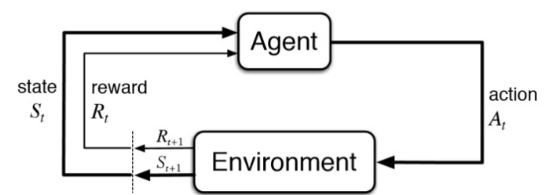
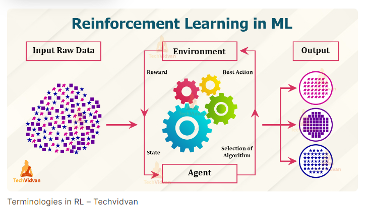
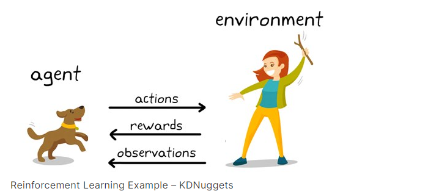

# Topic : 
----

## Introduction
In the ever-evolving world of machine learning, one approach that has gained significant attention is Reinforcement Learning (RL). This powerful technique allows machines to learn and improve through their own experiences, without the need for explicit programming or labeled data. In this comprehensive guide, we will delve into the intricacies of Reinforcement Learning, exploring its fundamental concepts, how it works, and its practical applications in various domains.

### What is Reinforcement Learning?
Reinforcement Learning is a type of machine learning where an agent, or decision-maker, learns by interacting with an environment and receiving feedback in the form of rewards or penalties. The agent's goal is to maximize the cumulative reward it receives over time by taking the most appropriate actions. This learning approach is based on the principle of trial and error, where the agent continuously explores the environment, observes the outcomes of its actions, and adjusts its strategy accordingly.

### Terminologies used in Reinforcement Learning

1. **Agent:** The learner or decision-maker that interacts with the environment.

2. **Environment:** The world or situation in which the agent operates.

3. **Action:** The choices available to the agent in a given state.

4. **State:** The current situation or configuration of the environment.

5. **Reward:** Feedback from the environment indicating the desirability of the agent’s actions.

6. **Policy:** The strategy or rule that the agent follows to select actions.

7. **Value Function:** An estimate of the expected cumulative reward for being in a particular state or taking a specific action.

8. **Model:** A representation of how the environment behaves, allowing the agent to predict future states and rewards.

### How Does Reinforcement Learning Work?
The Reinforcement Learning process can be broken down into several key steps:

1. **Start in a state:** The agent begins in a particular state, which represents the current situation or context within the environment.

2. **Take an action:** Based on its current policy (a set of rules or strategies), the agent selects an action to perform in the environment.

3. **Receive a reward or penalty:** The environment provides feedback to the agent in the form of a reward or penalty, depending on the outcome of the action.

4. **Observe the new state:** After taking the action, the agent observes the new state of the environment, which becomes the starting point for the next decision cycle.

5. **Update the policy:** The agent then updates its policy to favor actions that lead to higher rewards in the long run, using various algorithms and techniques.

This cyclical process of exploration, feedback, and policy updates allows the agent to continuously learn and improve its performance over time, ultimately maximizing the total cumulative reward.

### Reinforcement Learning Approaches
Reinforcement Learning algorithms can be broadly categorized into two main approaches:

1. **Value-Based Approaches:** These methods focus on learning a value function that estimates the expected future reward for an agent in a given state under a specific policy. The agent's goal is to maximize this value function to achieve the highest long-term reward.

2. **Policy-Based Approaches:** These methods directly learn the policy function, which maps states to actions. The goal is to find the optimal policy that leads to the highest expected future rewards.

Within these broader categories, there are various specific algorithms, such as Q-Learning, SARSA, REINFORCE, and Proximal Policy Optimization (PPO), each with its own strengths and applications.

### How is Reinforcement Learning different from Supervised Learning?

1. Data and Feedback
- Reinforcement Learning: Doesn’t use labeled data. The agent interacts with the environment and receives feedback in the form of rewards (positive, negative, or neutral). The agent learns through trial and error to maximize future rewards.

2. Learning Process
- Reinforcement Learning: The model resembles an athlete learning through trial and error in a competition (environment). It receives feedback (rewards) but needs to figure out the best strategy on its own.

3. Goal
- Reinforcement Learning: The objective is to learn a policy or strategy that maximizes long-term rewards within an environment.

### Practical Applications of Reinforcement Learning
Reinforcement Learning has a wide range of practical applications across different industries and domains, including:

1. Robotics and Automation\
2. Game AI
3. Autonomous Vehicles
4. Healthcare and Personalized Medicine
5. Finance and Trading

## Conclusion
Reinforcement Learning is a powerful and versatile machine learning technique that has the potential to revolutionize the way we approach problem-solving and decision-making. By empowering agents to learn and adapt through their own experiences, Reinforcement Learning opens up new avenues for developing intelligent systems that can tackle complex challenges and optimize for long-term success.

[reference](https://www.analyticsvidhya.com/blog/2021/02/introduction-to-reinforcement-learning-for-beginners/)