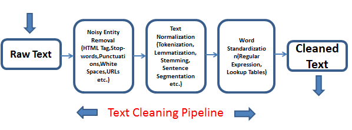
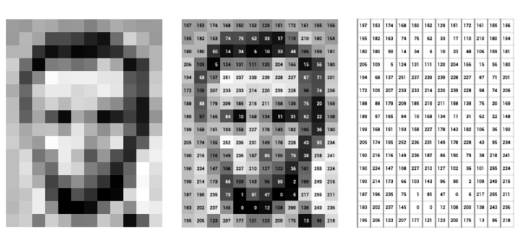
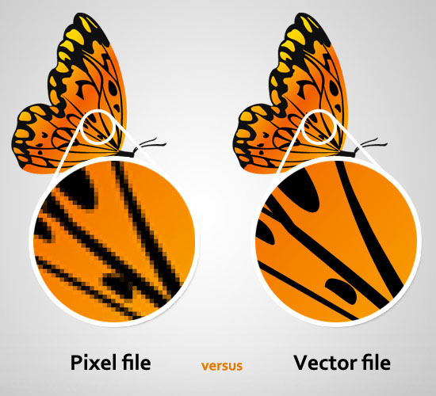

# Topic : Data Preprocessing 
----

**What is Data and it's two type**

Data is a word we hear everywhere nowadays. In general, data is a collection of facts, information, and statistics and this can be in various forms such as numbers, text, sound, images, video or any other format. And it has two type namily Structured data and Unstructured data.

1. Structured Data
- Organized in a clear, predefined format like tables.
- Easy to analyze and process.
- Examples: databases, spreadsheets.

2. Unstructured Data
- Lacks a predefined format or structure.
- Contains diverse, complex information like text, images,videos.
- Challenging to analyze and process directly.

It knows that AI are trained by feeding a combination of both structured and unstructured data allowing them to leverage the strengths of each type and produce more comprehensive results.

## Data Preprocessing
**What and Why preprocess?**
Its transforming of the data into a format that is easier and effective to be fed to AI which makees it easier for them to learn and to get accurte output.
Like all even machine learning can learn and train faster if they are fed with structure and well formated datasets that have gone through a preprocessing. 

### Introduction to NLP
Before diving into the specifics of text preprocessing and image preprocessing, it's essential to understand the significance of NLP and its applications. NLP deals with the interaction between computers and human (natural) languages, enabling machines to comprehend, interpret, and generate human-like text.

## Text preprocessing
Text preprocessing involves cleaning and standardizing text data before analysis or modeling. This process ensures consistency, improves analysis accuracy, and enhances the performance of natural language processing tasks like sentiment analysis(emotion analysis) and text classification.

### Techniques for Text Preprocessing
**WHY**

To have a **cleaned text**.
 

**Text Lowercasing**

**What**

 Text lowering involves converting all letters in the text to lowercase. 

**Why**

This is done to standardize the text and reduce the size of the vocabulary.Lowercasing ensures that words with different cases are treated uniformly.

**Example** 

**Removing Punctuation**

**What:**
Removing punctuation involves eliminating punctuation marks such as periods, commas, and exclamation points from the text. 
**Why:**
This is done to ensure consistency and avoid treating punctuated variations of words separately. 

**Example:**

**Removing White Space**

**What:**
Removing white space involves eliminating excess whitespace, including spaces, tabs, and newline characters, from the text.

**Why:**
 This is done to clean up the text and make it more readable. 

 **Example:**

4. **Removing Stopwords**

**What:**
Stopwords are common words like "the", "is", and "and" that occur frequently in the language but don't carry significant meaning.
**Why:**
Removing stopwords helps in focusing on content-bearing words and reducing noise in the text data. 
**Example:**
repreating of "that" is removed.
 

### Stemming v/s lemmatization

| Aspect | Stemming | Lemmatization |
| ----------- | ----------- | ----------- |
| Definition | Process of reducing words to their root form | Process of reducing words to their base or lemma |
| Root Word | Stem may not be a valid word | Lemma is always a valid word |
| Context Consideration | Does not consider the context of the word | Considers the context of the word |
| Language Preservation | May not preserve language integrity | Preserves language integrity |
| Efficiency | Generally faster | Can be slower due to context analysis |
| Example | Running -> Run, books -> book  | 	Running -> Run, Better -> Good |

## Image Preprocessing
Images is nothing more than a two-dimensional array of numbers(or pixels) : it is a matrices of pixel values. 

.jpg)

Image preprocessing is the process of manipulating raw image data into a usable and meaningful format. It allows us to eliminate unwanted distortions and enhance specific qualities essential for computer vision applications.

**Reason:** Preprocessing an image can  help the model focus on learning meaningful features rather than being distracted by irrelevant variations which inhances the accuracy of the model.

### Types of Image

1. **Raster Image**
Raster images are constructed through pixels.
Example: **JPEG and PNG**

2. **Vector Image**
Vector images are constructed through lines and curves.
Example: **SVG and PDF**

**Comparison between image of two type**

 ### Types Image Formats
1. **JPEG/JPG (Joint Photographic Experts Group)**: Compressed image format suitable for photographs, but not ideal for graphics or line drawings due to potential loss of detail.
JPEG image

2. **PNG (Portable Network Graphics)**: Offers high-quality graphics with compression and support for transparency. Commonly used for web images requiring sharpness and transparency effects, but may result in larger file sizes compared to JPEGs.
PNG image

3. **SVG (Scalable Vector Graphics)**: Ideal for web icons and graphics due to its scalability without loss of quality. Complex SVGs may slow down website loading.

4. **PDF (Portable Document Format)**: Versatile format for electronic documents, supporting embedded links and encryption. Widely compatible and commonly used for sharing documents.

### Type of Data Compression

- **Lossy Compression** reduces file size by discarding some data, compromising quality. It's commonly used for audio, images, and video where slight loss in quality is acceptable.

- **Lossless Compression** maintains original quality by reducing file size without any data loss. It's suitable for text files, documents, and images where preserving quality is crucial.

