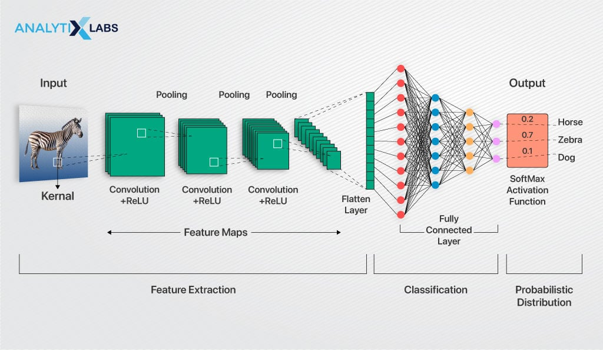

# Topic : Convolutional Neural Networks
----

## Foundations of Convolutional Neural Networks
A Convolutional Neural Network (CNN) is the extended version of artificial neural networks (ANN) and is  well-suited for image and video analysis.

**CNN architecture**
Convolutional Neural Network consists of multiple layers like the input layer, Convolutional layer, Pooling layer, and fully connected layers. 

**Layers used to build A complete Convolution Neural Networks architectur**
- **Input Layers:** It’s the layer in which we give input to our model.

- **Convolutional Layers:** This is the layer, which is used to extract the feature from the input dataset. It applies a set of learnable filters known as the **kernels** to the input images. The filters/kernels are smaller matrices usually **2×2, 3×3, or 5×5** shape. it slides over the input image data and computes the dot product between kernel weight and the corresponding input image patch. The output of this layer is referred as **feature maps.**

- **Activation Layer:** By adding an activation function to the output of the preceding layer, activation layers add nonlinearity to the network. it will apply an element-wise activation function to the output of the convolution layer. Some common activation functions are RELU: max(0, x),  Tanh, Leaky RELU, etc. **The volume remains unchanged**.

- **Pooling layer:** This layer is periodically inserted in the covnets and its main function is to reduce the size of volume which makes the computation fast reduces memory and also prevents overfitting. Two common types of pooling layers are max pooling and average pooling.

- **Flattening:** The resulting feature maps are flattened into a one-dimensional vector after the convolution and pooling layers so they can be passed into a completely linked layer for categorization or regression.

- **Fully Connected Layers:** It takes the input from the previous layer and computes the final classification or regression task.

- **Output Layer:** The output from the fully connected layers is then fed into a logistic function for classification tasks like sigmoid or softmax which converts the output of each class into the probability score of each class.

How CNN works in general
### Advantages of Convolutional Neural Networks (CNNs):
1. Good at detecting patterns and features in images, videos, and audio signals.
2. Robust to translation, rotation, and scaling invariance.
3. End-to-end training, no need for manual feature extraction.
4. Can handle large amounts of data and achieve high accuracy.

### Disadvantages of Convolutional Neural Networks (CNNs):
1. Computationally expensive to train and require a lot of memory.
2. Can be prone to overfitting if not enough data or proper regularization is used.
3. Requires large amounts of labeled data.
4. Interpretability is limited, it’s hard to understand what the network has learned.

**Difference between a convolution layer and a pooling layer**
- A convolution layer extracts features from an input 
- while a pooling layer downsamples the output of the convolution layers.
- Convolution layers use a series of filters to extract features.
- while pooling layers use a variety of techniques to downsample the data, such as max pooling and average pooling.

### Conclusion
A Convolutional Neural Network (CNN) is a type of deep learning neural network that is well-suited for image and video analysis. CNNs work by applying a series of convolution and pooling layers to an input image or video. Convolution layers extract features from the input by sliding a small filter, or kernel, over the image or video and computing the dot product between the filter and the input. Pooling layers then downsample the output of the convolution layers to reduce the dimensionality of the data and make it more computationally efficient.