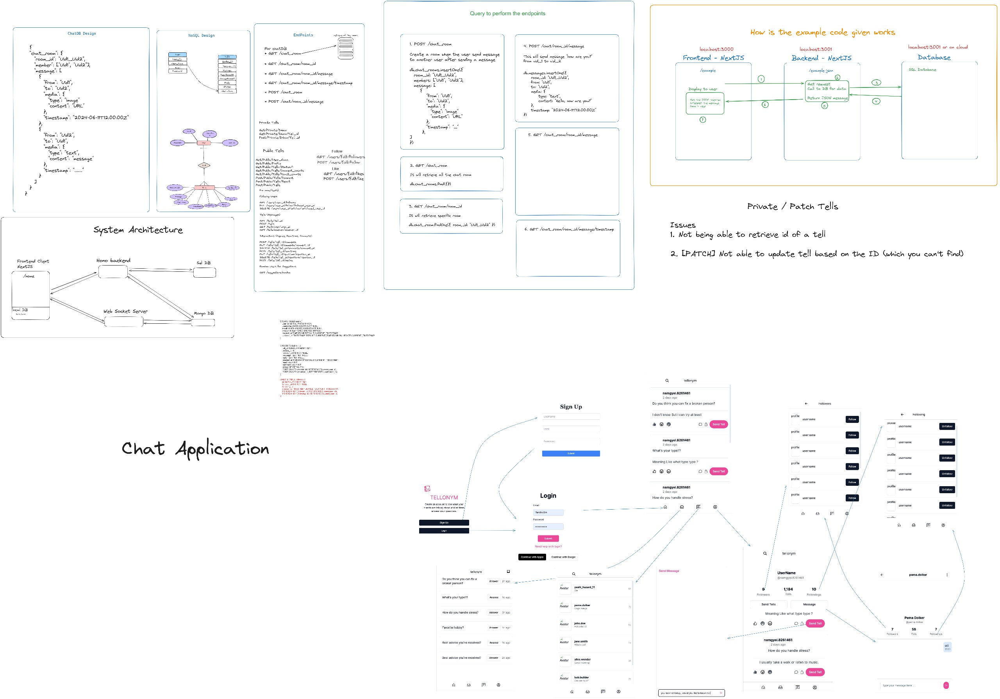

## Topic : Tellonym Clone Project 
---

This report provides a overview of our journey in developing a clone of Tellonym, a social networking platform known for its anonymous messaging features. Our project centered around building the backend using Hono and Prisma, alongside going through .tsx files for frontend development and Shadcn UI for interface design. Our goal was to make our version work like Tellonym, with features like real-time messaging and user profiles. Throughout this report, we delved through development journey, challenges faced, solutions implemented, and insights gained from the guidance and consultation provided by our lecturer.

## Table of Contents

1. [Project Overview](#project-overview)
2. [Work Distribution](#work-distribution)
3. [Lecturer Guidance](#lecturer-guidance)
4. [Authentication](#authentication)
5. [Home Page](#home-page)
6. [Chats](#chats)
7. [Profile (Public and Private)](#profile-public-and-private)
8. [Followers and Following](#followers-and-following)
9. [Authentication](#authentication)
10. [Challenges and Solutions](#challenges-and-solutions)
11. [Key Takeaways](#key-takeaways)
12. [Drawbacks](#drawbacks)
13. [Conclusion](#conclusion)

---

## Project Overview

1. **Project Scope**: The project aimed to replicate Tellonym's key features including real-time messaging, user profiles, and social interactions.

2. **Technologies Used**: Leveraged `.tsx` files for frontend development with Shadcn UI components, and utilized MongoDB for real-time communication and SQL databases for other data storage needs.

3. **Implementation Strategy**: Divided development into frontend and backend tasks, focusing on modular design and effective collaboration through Git.

---

## Work Distribution

### Team Responsibilities in Tellonym Clone Project

1. **Chimi Gyeltshen: Authentication Feature**

   - **Frontend**:
     - Utilized `.tsx` files and Shadcn UI for UI design.

   - **Backend**:
     - Implemented JWT for authentication.

2. **Khem Raj Galley and Tandin Om: Homepage Development**

   - **Frontend**:
     - Used `.tsx` files and Shadcn UI for components.

   - **Backend**:
     - Managed MongoDB schema design and API endpoints.

3. **Namgyel Wangchuk: Public Profiles**

   - **Frontend**:
     - Designed using `.tsx` files, Shadcn UI, and Tailwind CSS.

   - **Backend**:
     - Handled MongoDB schema design and API development.

4. **Rangjung Yeshi Norbu and Kanisha Pradhan: Chatbox Feature**

   - **Frontend**:
     - Implemented UI components and WebSocket communications.

   - **Backend**:
     - Designed MongoDB schema and managed message handling.

5. **Pema Dolkar: Private Profiles**

   - **Frontend**:
     - Developed UI using `.tsx` files and Shadcn UI.

   - **Backend**:
     - Integrated MongoDB and implemented API functionalities.

6. **Yonten Kinley Tenzin: Follower and Following Pages**

   - **Frontend**:
     - Managed with `.tsx` files, Shadcn UI, and React Icons.

   - **Backend**:
     - Oversaw CRUD operations, MongoDB management for user relationships, and API implementation.

7. **Collaboration**: Used GitHub for version control and collaboration, ensuring everyone could work on different parts of the project simultaneously. Together we designed the database schemas.

---

## Lecturer Guidance

The consultation played a vital role in guiding the Tellonym clone project, offering knowledge in database schema design with a focus on MongoDB for real-time communication and SQL for other functionalities. Sir provided a comprehensive project overview, helped us understand the structure and interactions between different components. Regular feedback sessions and continuous support were crucial in helping us tackle difficult topics like WebSocket setup and user authentication. This guidance ensured that we learned important lessons and overcame obstacles effectively while developing the project.

Below is the **Schema Design** and the **Project Overview** of our project.

## Authentication

**Frontend Development**

1. **User Login and Registration**: Implemented forms for user login and registration using Shadcn components.

2. **Authentication Flow**: Ensured smooth authentication flow, redirecting users to the homepage upon successful login.

**Backend Development**

1. **Endpoints**: Created endpoints for user registration, login, and logout.

2. **Token Management**: Implemented JWT for managing user sessions securely.

## Home Page

**Frontend Development**

During the first week, we focused on developing the homepage for Tellonym.

1. **Designing the Database Schema and API Endpoints**: We began by designing the database schema and API endpoints to fetch homepage data.

2. **UI Design**: We used Shadcn UI and reusable components to display all replied tells on the homepage. This was challenging, but we learned how to effectively use reusable components.

3. **Reusable Components**: Initially, we struggled to use reusable components across multiple pages, like the navigation bar. After a few days of trial and error, we became confident in using these components.

4. **User Interface Design**: Mimicking Tellonym's UI was tough. We used Tailwind CSS for arranging components and React Icons to enhance the UI.

**Frontend Features**

1. **User Interface**: The homepage shows the user's profile picture, name, and other details. It also displays tells from people the user follows.

2. **Interaction Buttons**: Users can like, share, or comment on tells using React Icons, making interactions easy.

3. **Recommendations**: The homepage suggests new users to follow based on user interactions and interests.

**Backend Features**

1. **Server Setup**: The server handles all user requests to ensure smooth operation.

2. **Database Storage**: All messages and profile information are stored in MongoDB, keeping data safe and accessible.

**How It Works**

1. **WebSocket Connection**: Establishes a connection to the server upon opening the homepage.

2. **Real-Time Updates**: Allows immediate updates for tells, likes, and comments without refreshing the page.

**Challenges**
It took a long time to complete the frontend part of the application and because of that we couldn't connect to the server part of the application. We dindn't regret focusing more on the frontend part because we learn alot about the components and all.

**Experiences**:

After doing the final project now we have gained confidence on building the asthetic interface. It feels like we can make any other frontend part of any application.

---

## Chats

**Frontend Development**

1. **Database Schema**: Designed using MongoDB for chats.

2. **UI Design**: Implemented using WebSockets, Shadcn UI, and React Icons. We created two UI components: one for the chat list and one for personal messages.

**Frontend Features**

1. **Message Display**: Messages are shown in chat bubbles, with user messages on the right.

2. **Input and Send Button**: Users can type messages and send them using a pink send button. Messages appear instantly due to real-time updates.

**Backend Features**

1. **Server Setup**: Built with Node.js and Hono, handling connections and requests.

2. **WebSocket Connection**: Manages real-time communication with Socket.io.

3. **Database Storage**: Messages are stored in MongoDB Atlas, ensuring they are saved and retrievable.

**How It Works**

1. **Connecting**: Users connect to the backend server using WebSockets.

2. **Joining a Room**: Users join a specific chat room based on a unique room ID.

3. **Sending a Message**: Messages are sent to the backend server, saved to the database, and displayed in the chat room.

**Challenges**
- Did not have any pior knowledge on about connecting to different database like mongodb and postgres making it difficult to start resulting to wastage of 2 days.
- Had to ajust to showing of just the demo cause authentication to idetify a particular user was not successful.

**Experienced**
- connecting to mongodb
- How websocket works
- Using reusable components, using shardcn, using taildwindcss and using react.
- Got more knowledge in designing the backend endpoints for the chats
- Designing the schema in mongodb
---

## Profile (Public and Private)

**Frontend Development**

1. **Relation Schema and Endpoints**: Designed relation schema and endpoints for public and private profiles.

2. **UI Design**: Used Shadcn UI and Tailwind CSS to design reusable components for profiles.

**Frontend Features**

1. **Private Profile**: Shows user profile details and their tells with their replies. Gives the guest to react, send and message the user.

2. **Public Profile**: Displays user information and allows following,messaging and sending tells anonymously.

**Backend Development**

1. **Endpoints**: Created endpoints to manage user data and interactions.
- /tells = send tells (Chimi did this)(POST)
- /users/:userId/username = Get the user name of the specific id(GET)
- /tells/:userId = retrieve the tells and reply that have status 1 (GET)
- /tells/:tellId/react = react the tells (PATCH)
- /tells/:tellId/comment = react the comment (PATCH)
- /tells/:tellId/counts = count of the react and comment (GET)

**Challenges** 
- Storing the image in the db and not knowing how to display it on the page. 
- Connecting the frontend with the endpoints of the backend 

**Experienced**
- Arranging the components and effectively making use of usuable components like shardcn and our own designed components.
- Using tailwind css, routing and using react.
- Defining the endpoints by looking at the frontend.
- Got exposed on what its like to be a full stack developer.

---

## Private Tells

**Frontend Development**

1. **UI Design**: Designed the UI for the tells to be displye and making a reply button to reply to the tells.

**Backend Features**

1. **CRUD Functionality**: Implemented endpoints to retrive tells and to reply the tells making its status 1 (ready for it to be dispalyed).\

**Challenges**
- using the reasualbe components.
- designing the backend endpoints to retrive the tells anoymously and to reply it.

**Experienced**
- More comfortable in implementing the taildwindcss, shardcn and react.
- More comfortable in designing the backend endpoints 

1. **UI Design**: Designed the UI for follower and following pages.

**Backend Features**

1. **CRUD Functionality**: Implemented follow and unfollow actions with CRUD operations in the backend.

---

**Challenges**
- Hard time using components like shadcn/ui, and react components 
- Face merge error and clashes in code as we are working on same repo 
- Hard time coding endpoints
- Difficulty in coming up with a a schema  
- Designing the endpoints was challenging as i have to consider the foregin keys.

**Experienced**
- Better performance in implementing talindwindcss, using shardcn and using react components and icons.
- More proficient in making endpoints for relational schemas.
- Got more knowledge in using git collab repositories.
---

## Challenges and Solutions as Team

1. **Initial Setup**: Struggled with initial setup and understanding of JWT but resolved with research and guidance from the lecturer.

2. **Using Reusable Components**: Initially struggled but eventually mastered the use of reusable components.

3. **UI Design**: Faced difficulties mimicking Tellonym’s UI but became more confident with Tailwind CSS and React Icons.

4. **Database Integration**: Had trouble connecting two databases (MongoDB and Postgres) but resolved to use MongoDB.

5. **WebSocket Implementation**: Needed to complete authentication first; worked on demo implementation.

6. **Frontend and Backend Connection**: Many team members faced difficulties connecting the frontend and backend effectively.

7. **Collaboration**: Managed collaborative repositories and used new technologies through effective communication.

---

## Key Takeaways

1. **Learning Curve**: Gained significant experience with new technologies like Shadcn UI, WebSockets, and Tailwind CSS.

2. **Reusable Components**: Improved understanding and utilization of reusable components, enhancing code efficiency and maintainability.

3. **Real-Time Communication**: Successfully implemented real-time features using WebSockets, which is a critical aspect of modern web applications.

4. **Team Collaboration**: Enhanced team collaboration skills through effective use of GitHub and regular communication.

5. **Problem-Solving**: Developed strong problem-solving skills by overcoming various technical challenges and integrating feedback from the lecturer.

---

## Drawbacks

1. **Incomplete Integration**: Many team members struggled with connecting the frontend and backend, leading to incomplete integration of some features.

2. **Initial Struggles with Tools**: Faced initial difficulties with new tools and frameworks, which slowed down progress in the early stages.

3. **Limited Experience**: Lack of prior experience with technologies like JWT and WebSockets led to delays and required additional learning time.

4. **Dependency Issues**: Encountered dependency issues with some libraries and components, which required troubleshooting and workarounds.

---

## Conclusion

We successfully implemented key features of Tellonym such as the homepage, chat, profiles, and followers/following functionality. We faced challenges but learned a lot, becoming more confident in our web development skills. The project provided valuable experience and we look forward to further improving our Tellonym clone.